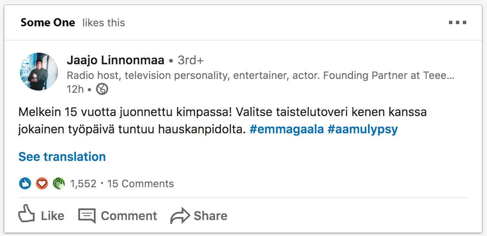

## Keep up training

I'm a front-end developer. So the bread and butter in my daily is to write semantically strong HTML and CSS. Well technically because I work with Typescript, ReactJs and styled-components what I might be writing can be JSX, or TSX or for example styled-component template literals. But the syntax is almost all the same and the results will be html and css. So I'm always trying to improve these cornerstone skills for developer.

I started this series so that I can create a easy template for me to publish some doodles that I'm used writing now and then.
The code itself is written to awesome <a href="https://codepen.io/" target="_blank">CodePen</a> and as you can see embeded to posts like below.

Here's a reference screenshot that I snapped from LinkedIn feed. Note that this is not a actual post but an edit I photoshopped to serve this example.

 

And here's the embedded CodePen that I created

<iframe height="520" style="width: 100%;" scrolling="no" title="Linkedin post box doodling" src="https://codepen.io/Mehto00/embed/PoqwjGq?height=349&theme-id=dark&default-tab=result" frameborder="no" allowtransparency="true" allowfullscreen="true">
  See the Pen <a href='https://codepen.io/Mehto00/pen/PoqwjGq'>Linkedin post box doodling</a> by Mikko Metso
  (<a href='https://codepen.io/Mehto00'>@Mehto00</a>) on <a href='https://codepen.io'>CodePen</a>.
</iframe>
