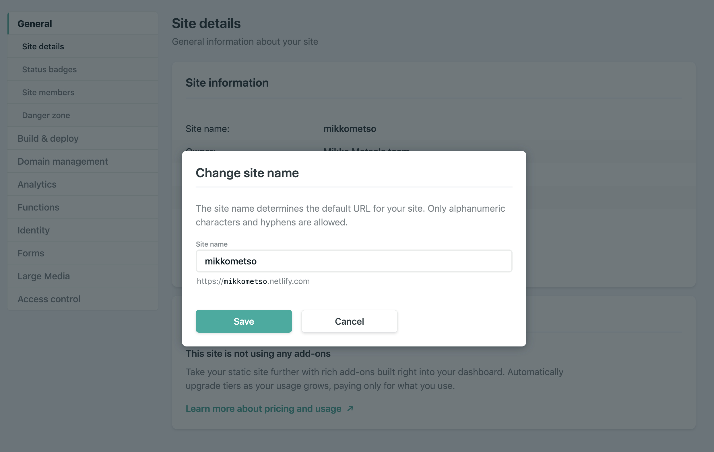
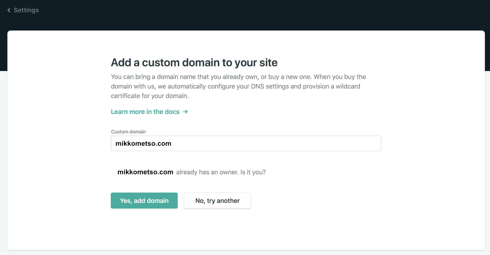
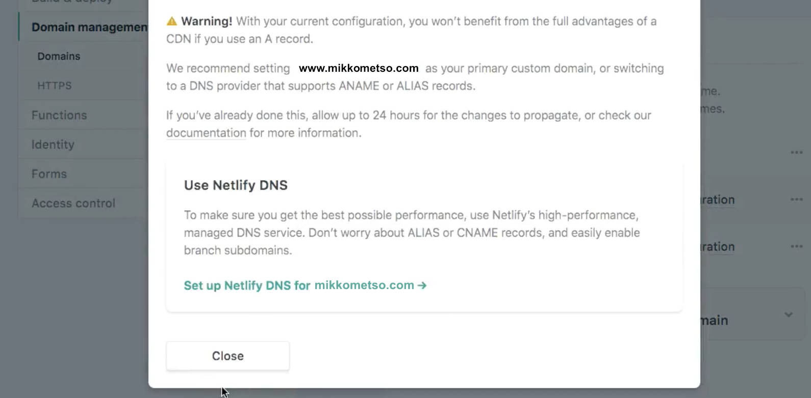
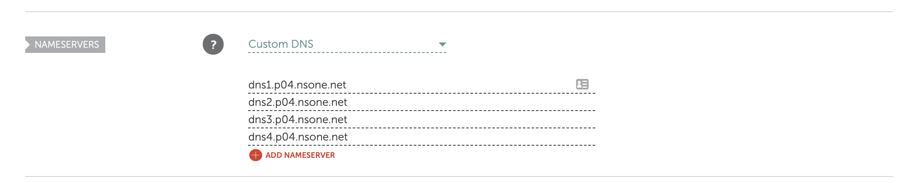

I have had my own domain name _mikkometso.com_ for my blog about five or six years. When I published this Gatsby blog project at first I kept it under _mikkometso.netlify.com_ and had my Wordpress site still running and _mikkometso.com_ domain was pointing there. After a few weeks I decided the new project was up and running enough so that the next thing for me would bee to change the address to point to Netlify instead. 

## Customizing netlify provided domain

Firstly (like me at first) if you're not interested on setting up the custom domain from Netlify, it's still usefull and also easy to setup a human-readable url instead of the randomly generated url that Netlify provides. From Netlify dashboard you navigate to your project and choose **Site settings**. Under **Site details** you can find the button that says **Change site name**. 

Pressing the button opens up a pop up that has the input field where you can feed the desirable site name, see the actual url and check if it's available.

## Adding your own custom domain

It has being made super easy to set up your own custom domain to a netlify project. You can start by navigating to projects Overview and click from the **Getting started** section the **Set up a custom domain** field that can be found as second. Or on the same page you can click on **Domain settings** or from Site settings choose the **Domain management**. You can't miss it. 

On Domain management there's a **Add custom domain** button. Clicking it start's a three phase funnel. Firstly Netlify asks user to input the custom domain name and verify if domain already has a owner. 

After this Netlify will ask if you are the owner and by clicking **Yes, add domain**. After that next to the newly added custom domain shows a warning symbol with text _Check your DNS configuration_. You can click it and get prompted a info screen that provides help how to set up the DNS configurations so that the domain gets connected. I found really usefull info about the setup from Netlifys own documents <a href="https://www.netlify.com/docs/custom-domains/" target="_blank">here</a> and from this awesome <a href="https://www.youtube.com/watch?v=Q9giWrfIJKk" target="_blank">youtube-video</a> by **Chris Stayte**.

The video also descripes how to easily set up a **https** to your site with free, automatic TLS certificates provided by awesome <a href="https://letsencrypt.org/" target="_blank">Let’s Encrypt</a>.

But the easiest way to set up the nameservers for me was to use Netlify DNS instead.

## Set up Netlify DNS

From the bottom of the previously mentioned _Check your DNS configuration_ prompt you can select **USE Netlify DNS** by clicking the **Set up Netlify DNS for _your-Site-Here_** button.

Again three steps here. First confirm that you want to add custom domain to Netlify by creating a DNS zone for the domain. Next Netlify will create the DNS records required for ones Netlify site automatically. 

After that Netlify will finally prompt out the newly assigned DNS nameservers that you should add to your domain registrars systems. At least for me this was a fairly easy task. My domain registrar is _NameCheap_ and their dashboard made it easy and quick to add the needed nameservers. 

And volá! There you have it. After this you have your domain pointing to your project. And as always in the world of nameservers and dns thingies, results may not be visible right away. As it's said on Netlifys pages 

_Depending on your DNS provider, changes to DNS records can take several hours to propagate and take effect for the entire internet._ <a href="https://www.netlify.com/docs/custom-domains/#automatic" target="_blank">[1]</a>  

Also it's worth mentioning that if your planning to use your domain for other services as well like emails you will need more additional settings to the configuration

_We are happy to support DNS for all records in your domain including ones that don’t point to our service; if you’re using your domain for other services, like email, you will need to add all other records like MX, etc, in this step._ <a href="https://www.netlify.com/docs/custom-domains/#automatic" target="_blank">[2]</a>  

_edit 16.10: Added mention about the https on youtube-video_