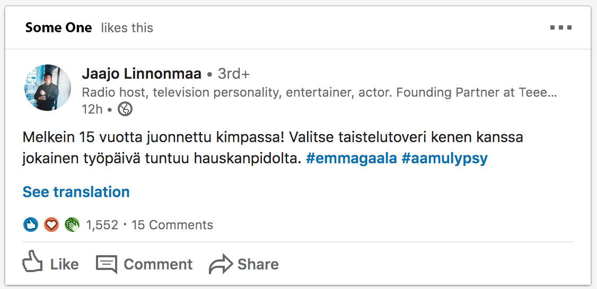

## Keep up training

I’m a Front-End Developer so the bread and butter in my daily work is to write semantically strong HTML and CSS. 

Technically because I work with Typescript, ReactJs and styled-components what I might be writing at work can be for example JSX, or TSX or styled-component template literals. So almost everything is JavaScript but the syntax is almost all the time similar to HTML and CSS and the results will be presented on browser as such. 

So I’m always trying to improve these cornerstone skills for developer and these tiny doodles are all for that. Basic leg work that helps me become a better coder in the long run.

I started this series so that I can create a easy template for me to publish some doodles that I'm used writing now and then.
The code itself is written to awesome <a href="https://codepen.io/" target="_blank">CodePen</a> and as you can see embeded to posts like below.

Here's a reference screenshot that I snapped from LinkedIn feed. Note that this is not a actual screenshot about some post but an edit I photoshopped to serve this example.

 

And here's the embedded CodePen that I created

<iframe height="520" style="width: 100%;" scrolling="no" title="Linkedin post box doodling" src="https://codepen.io/Mehto00/embed/PoqwjGq?height=349&theme-id=dark&default-tab=result" frameborder="no" allowtransparency="true" allowfullscreen="true">
  See the Pen <a href='https://codepen.io/Mehto00/pen/PoqwjGq'>Linkedin post box doodling</a> by Mikko Metso
  (<a href='https://codepen.io/Mehto00'>@Mehto00</a>) on <a href='https://codepen.io'>CodePen</a>.
</iframe>

All of my CodePens can be found <a href="https://codepen.io/Mehto00/pens/showcase" target="_blank">here</a>.